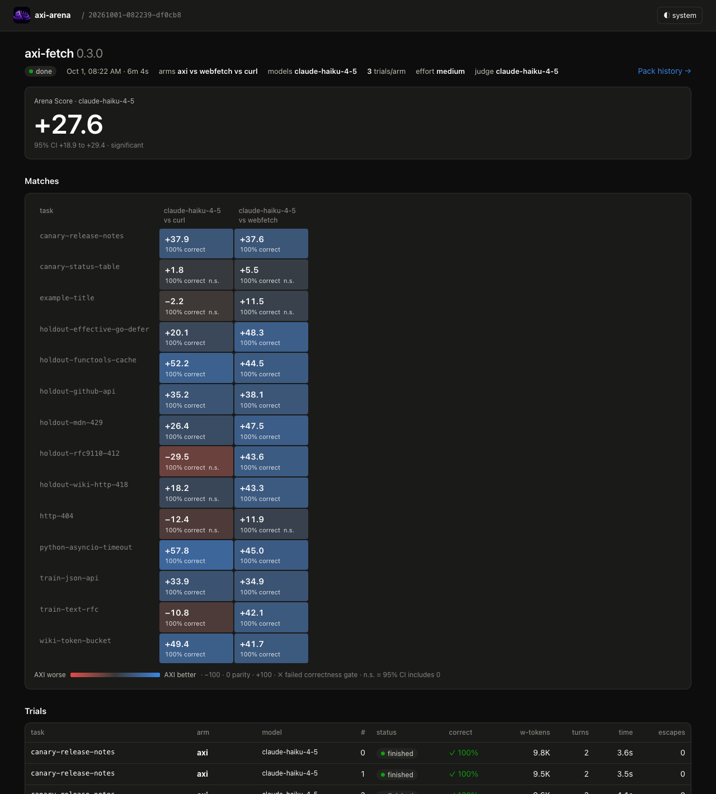
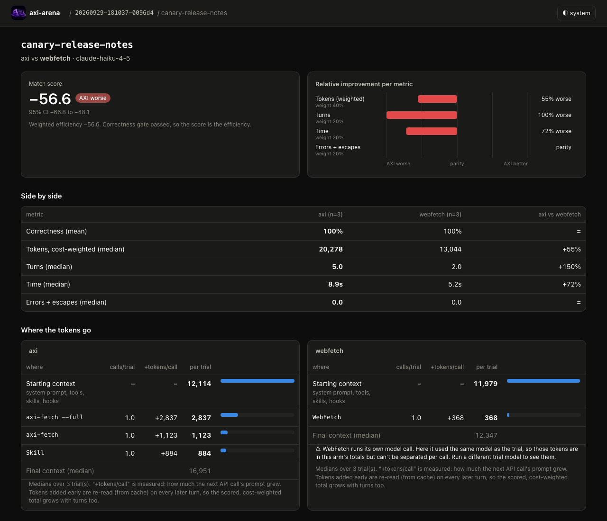

<p align="center">
  
</p>

<h1 align="center">axi-arena</h1>

<p align="center">
  Benchmark an <a href="https://axi.md">AXI</a> (Agent Experience Interface) against its native counterpart,<br>
  using real agent trials, not token counts.
</p>

---

An AXI is a CLI designed for agents: compact [TOON](https://toonformat.dev) output, content-first
defaults, next-step hints, structured errors. The claim is that agents do better with them. **axi-arena
checks that claim.** It gives the same task to the same model twice, once with the AXI and once with
the tool the agent would otherwise use (Claude Code's `WebFetch`, `gh`, an MCP server, …). Then it
compares correctness, tokens, turns, time and errors across many trials.

Measuring output size alone misses what matters. A tool can shrink its output by 80% and still
cost the agent more: an extra turn to load its skill, a second call because the first one truncated
the answer, a failed call the agent had to recover from. The arena counts all of that.

<p align="center"></p>

## How it works

```
axi-arena run packs/axi-fetch --models claude-haiku-4-5,claude-sonnet-5-5 --trials 3
```

For every **task × model × trial**, the arena runs two isolated [Claude Agent SDK](https://code.claude.com/docs/en/agent-sdk/overview)
sessions, one per **arm**:

| | `axi` arm | baseline arm (e.g. `webfetch`) |
|---|---|---|
| Tool definitions | identical in both arms | identical in both arms |
| Allowed to use | the AXI's commands (`Bash(axi-fetch:*)`) + its skill | the native tool (`WebFetch`) |
| Everything else | denied, counted as an **escape** | denied, counted as an **escape** |

Each trial is then **graded**. Deterministic checks run first (`contains`, `regex`, `json_path`,
`tool_called`, scripts). An LLM judge then scores the answer 0–1 against a rubric, using the check
results as evidence. A failed `required` check scores 0 regardless of the judge.

Matches roll up into the **Arena Score**:

- **0 = parity with native**, **+40** = 40% better on weighted efficiency, **negative** = worse.
- Efficiency is the relative improvement in tool tokens (40%), turns (20%), time (20%) and
  errors + escapes (20%). Tool tokens are what the tool calls put into the context, plus any side
  model a tool runs. Weights and the token metric can be set per pack.
- Being more correct than the baseline adds to the score.
- A **correctness gate** comes first: an AXI that is cheaper but less correct fails the match.
- Every score comes with a **bootstrap 95% confidence interval**; differences that could be noise are marked `n.s.`

## Quickstart

**Requirements:** Node ≥ 24, a logged-in [Claude Code](https://code.claude.com) or an
`ANTHROPIC_API_KEY`, and the `openssl` CLI (for network replay).

```sh
git clone https://github.com/tforgach/axi-arena && cd axi-arena
npm install
npm run build                                   # build the web UI once

npm run arena -- validate packs/axi-fetch       # check the pack
npm run arena -- estimate packs/axi-fetch --models claude-haiku-4-5 --trials 1
npm run arena -- serve                          # web app → http://127.0.0.1:4477
npm run arena -- run packs/axi-fetch --models claude-haiku-4-5 --trials 3   # in another terminal
```

`run` prints a link to watch the run live. Results are stored in `~/.axi-arena/arena.db` (override
with `AXI_ARENA_HOME`).

> **Auth.** Trials use the same credentials as your Claude Code, and nothing else from your setup.
> That means an `ANTHROPIC_API_KEY`, gateway tokens, Bedrock/Vertex/Foundry env, and the credential
> helpers (`apiKeyHelper`, AWS/GCP refresh) plus `modelOverrides` from `~/.claude/settings.json`.
> You can add or override them, set model aliases and register packs by name in
> `~/.axi-arena/config.yaml`. A corporate `HTTPS_PROXY` and CA are supported. Every run starts with a
> **preflight** (one tiny call per model) so bad credentials fail before anything is spent. Try it
> alone with `npm run arena -- preflight --models sonnet,haiku`. See [SPEC.md §4.4](SPEC.md). Check
> Anthropic's [Agent SDK terms](https://code.claude.com/docs/en/agent-sdk/overview) for what applies
> to your account.

## CLI

```
axi-arena run <pack>        Run trials, grade them, print the Arena Score
axi-arena record <pack>     Record network fixtures (1 trial per arm; saves what's missing)
axi-arena estimate <pack>   Trial count + token estimate from previous runs, without running
axi-arena validate <pack>   Check manifest, tasks, scripts, skills and fixtures
axi-arena list              Recent runs
axi-arena show <run-id>     Scoreboard for a run (--detail for per-arm medians)
axi-arena rescore <run-id>  Re-grade from stored transcripts; no agents re-run (--metrics-only: no judging)
axi-arena preflight         Check credentials and model access without running anything
axi-arena serve             Web app on 127.0.0.1 (live runs, with a Cancel button)

Run flags: --models a,b  --trials N  --tasks 'glob'  --tags t  --arms axi,x  --concurrency N
           --effort low|medium|high|xhigh|max  --network replay|record|live
           --judge-model id  --no-judge  --keep  --yes
```

## Writing a pack

A **pack** is a folder that describes one AXI's benchmark. It can live anywhere, so packs for private
or work AXIs never need to be in this repo. `packs/axi-fetch` is the reference pack.

```
my-axi-pack/
├── arena.yaml          arms, defaults, scoring, setup
├── tasks/*.yaml        one task per file
├── skills/<name>/      SKILL.md files given to the axi arm
├── hooks/              SessionStart etc. scripts (ambient context; counts against the arm)
├── fixtures/<task>/    recorded + synthetic network responses
└── scripts/            setup / teardown / per-trial before / after / check scripts
```

```yaml
# arena.yaml
name: axi-fetch
version: 0.2.0
axi_version_cmd: axi-fetch --version
setup: scripts/setup.sh          # e.g. install a pinned AXI into .tools/

defaults:
  trials: 3
  models: [claude-sonnet-5-5]
  effort: medium                 # fixed per run
  network: replay                # replay | record | live
  judge_model: claude-haiku-4-5

scoring:
  token_metric: tool             # default; `session` scores whole-session tokens instead

arms:
  axi:
    tools: [Bash]
    allow: ["Bash(axi-fetch:*)"]
    deny: ["Bash(axi-fetch update:*)"]
    hooks: { SessionStart: hooks/usage.sh }   # ambient usage (or skills: + skill_delivery)
    path: [.tools/node_modules/.bin]
  webfetch:                      # one or more baselines: built-in tools, CLIs, MCP servers
    tools: [WebFetch]
    allow: [WebFetch]
  curl:
    tools: [Bash]
    allow: ["Bash(curl:*)", "Bash(grep:*)", "Bash(head:*)"]
    hooks: { SessionStart: hooks/curl-usage.sh }
```

```yaml
# tasks/canary-release-notes.yaml
id: canary-release-notes
prompt: >
  According to the release notes at https://tidewright.github.io/release-notes,
  in which Tidewright version was the --strict-tides flag added, and what is its default?
network: replay
checks:
  - { type: regex, pattern: '4\.7\.0', required: true }
  - { type: contains, value: "false", required: true }
  - { type: tool_called, min: 1 }
judge:
  rubric: Correct if it says the flag was added in 4.7.0 and defaults to false.
```

Arms can deliver their skill with `skill_delivery: preload` (in the system prompt, like a
CLAUDE.md) instead of the default `invoke` (the agent spends a turn loading it), or use a
`SessionStart` hook for ambient usage.

Stateful AXIs (tickets, databases, …) can use `setup`/`teardown`, per-task `before`/`after`, and
`script` checks that inspect the real system. `sequential: true` stops those trials from running
in parallel.

## Fairness and isolation

The arena spends most of its effort on keeping the comparison honest:

- **Clean sessions.** Your `~/.claude` settings, CLAUDE.md, skills, MCP servers and claude.ai
  connectors are not loaded. Each trial has its own working directory and its own cache and config
  directories, so an AXI's disk cache can't carry over between trials.
- **Tool parity.** Every arm carries the same built-in tool definitions; only the permissions differ.
  MCP servers are per arm, so an AXI that replaces an MCP server isn't charged for its schemas.
- **What counts as an escape.** An escape is reaching for an *equivalent* tool (`curl`, `WebFetch`,
  `python`, …). These are all allowed: harmless helpers (`cd`, `ls`, `echo`, `which`, …), text
  filters *after* the AXI in a pipe (`axi-fetch url | head -50`, `| jq .`), and calling the AXI by
  its path. The lockdown parses chained commands, so `axi-fetch x; curl y` and `curl … | head`
  don't slip through.
- **Two token views.** *Session* tokens (cost-weighted, everything the session cost) and *tool*
  tokens (only what tool calls added, plus side models such as WebFetch's summarizer). Fixed session
  overhead (~9–12k tokens of system prompt and tool definitions) dilutes session-level percentages:
  axi-fetch's −62% session saving on a docs page is −95% in tool tokens. Tool tokens are scored by
  default (`scoring.token_metric: tool`); session tokens stay visible.
- **Correctness is rewarded, not just gated.** Being more correct than native adds to the score.
- **Hidden costs are counted.** Tokens are summed over every model a trial used, so WebFetch's
  internal summarizer counts too. Scored tokens are cost-weighted (cache reads ×0.1, writes ×1.25,
  output ×5).
- **Errors that are the answer aren't penalized.** A clean non-zero exit on a 404 is good AXI
  behavior. Only errors the agent had to recover from count against it.
- **Reproducible network.** Each trial gets a record/replay proxy. Both arms see byte-identical
  pages, runs stay comparable over time, and **canary tasks** can use invented pages that no model
  can answer from memory. Anthropic's API traffic passes straight through. Recorded fixtures keep
  only an allowlist of safe headers, so servers that echo your IP don't leak it into the repo.

## Where the tokens go

The web app shows live transcripts, match details and pack history across AXI versions. The per-command
token view is measured: each call's cost is how much the next API call's prompt grew.

<p align="center"></p>

## Results: axi-fetch 0.2.0

The reference pack benchmarks [axi-fetch](https://github.com/tforgach/axi-fetch) 0.2.0 (usage
delivered as ambient context) against Claude Code's built-in `WebFetch` and against raw `curl`.
6 tasks (2 of them canaries), Claude Haiku 4.5, 3 trials per arm, replayed network, scored on tool
tokens. The AXI was **100% correct on every task** and made zero escapes.

**Arena Score +31.9** (95% CI +28.8 to +35.7), significant against both baselines.

| Task | Tool tokens vs WebFetch | vs curl | Turns (vs curl) |
|---|--:|--:|--:|
| python-asyncio-timeout (long docs page) | **−95%** | **−89%** | 2 vs 12 |
| wiki-token-bucket | **−91%** | **−88%** | 2 vs 3 |
| canary-release-notes (answer deep in the page) | **−89%** | **−90%** | 2 vs 2 |
| example-title | −46% | −10% | 2 vs 2 |
| canary-status-table | −36% | −25% | 2 vs 2 |
| http-404 | −16% | −31% | 2 vs 2 |

By baseline: **+29.0 vs WebFetch** [+26.9, +31.4] and **+34.9 vs curl** [+28.8, +41.6].

It took several steps to get there, all measured in the arena and scored the same way:

| axi-fetch | Arena Score vs WebFetch |
|---|---|
| 0.1.x, usage delivered as a skill | −49.0: extra turns for the skill load, then `--full`, then a `Read` of an output too big to show inline |
| 0.1.x, usage delivered by a hook | +4.8 (not significant) |
| **0.2.0** (`--find`, paging, leaner defaults) + hook | **+29.0** |

Session totals, which include ~9–12k tokens of fixed system-prompt and tool overhead and are noisy
with prompt-cache warmth, show the same direction but smaller: −62% on the docs page and −42% on
Wikipedia. That's why the score uses tool tokens by default. Early numbers: one model, a small task set.

## Repository layout

```
packages/core   pack schema, isolation, lockdown, runner, proxy, checks, judge, scoring (TypeScript)
packages/cli    the axi-arena command
packages/web    Hono API + SSE server and the React/Vite UI
packs/axi-fetch reference pack
SPEC.md         the full design, decisions and their rationale
```

## Development

```sh
npm test            # node:test, no API calls
npm run typecheck
npm run dev:web     # UI with hot reload; proxies /api to a running `axi-arena serve`
```

Node runs the TypeScript directly; only the UI has a build step.

## Status

Milestones M0–M4 are done: runner, scoring, web app and replay. Next up (M5): model-matrix runs and
validation against stateful AXIs. See [SPEC.md](SPEC.md) for the full design and decision log.

## License

[MIT](LICENSE). Recorded fixtures in `packs/axi-fetch/fixtures/` are copies of third-party pages under
their own terms; see [the fixtures README](packs/axi-fetch/fixtures/README.md).
